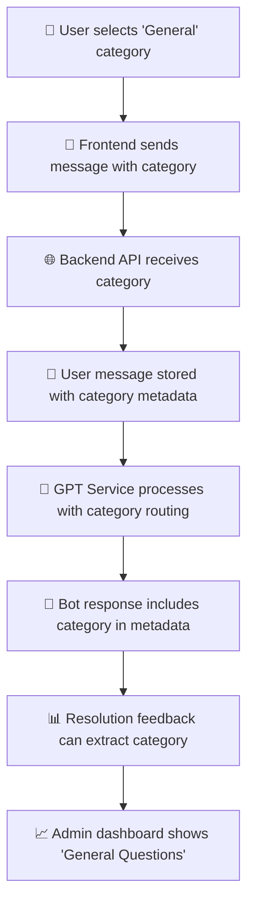

# Category Not Updating in Admin Dashboard - Issue Analysis & Solution

## 🎯 Issue Summary

**Problem**: When selecting "General" category and asking a question, the admin dashboard's "Common Issues" section doesn't show "General Questions" being updated.

**Root Cause**: The category selected by users wasn't being properly stored in the database and passed through the entire message flow.

## 🔍 Issue Analysis

### The Problem Chain:
1. ✅ **Frontend**: Category selection works correctly
2. ✅ **API Request**: Category is sent to backend in message payload
3. ❌ **Message Metadata**: Category wasn't stored in user message metadata
4. ❌ **Bot Response**: Category wasn't included in bot response metadata  
5. ❌ **Resolution Feedback**: Without category in message metadata, feedback couldn't be categorized
6. ❌ **Admin Dashboard**: No "general" category data to display

### Database Evidence:
```sql
-- Current resolution_feedback data shows only hsbc_internal
SELECT category, COUNT(*) FROM resolution_feedback WHERE category IS NOT NULL GROUP BY category;
-- Result: hsbc_internal: 5 (no 'general' category entries)

-- No messages with category metadata found
SELECT JSON_EXTRACT(message_metadata, '$.category') FROM chat_messages WHERE JSON_EXTRACT(message_metadata, '$.category') IS NOT NULL;
-- Result: Empty (no category metadata in messages)
```

## ✅ Solution Implemented

### 1. **Fixed User Message Metadata Storage**
**File**: `/root/Bot/backend/app/api/chat.py`

```python
# BEFORE: Category was missing from user message metadata
user_message = ChatMessage(
    conversation_id=conversation.id,
    sender_type="user", 
    message_content=message_data.message,
    message_metadata={
        "server_name": message_data.server_name,
        "correlation_id": message_data.correlation_id
        # ❌ category was missing
    }
)

# AFTER: Category included in user message metadata
user_message = ChatMessage(
    conversation_id=conversation.id,
    sender_type="user",
    message_content=message_data.message,
    message_metadata={
        "server_name": message_data.server_name,
        "correlation_id": message_data.correlation_id,
        "category": message_data.category  # ✅ Added category
    }
)
```

### 2. **Fixed GPT Service Category Handling**
**File**: `/root/Bot/backend/app/services/gpt_service.py`

```python
# Updated process_user_query to ensure category is in all response metadata
if category:
    logger.info(f"✅ Category provided: '{category}' - routing to category handler")
    response = await self._handle_category_based_query(message, category, server_name, correlation_id, user_context)
    # ✅ Ensure category is in metadata
    if 'metadata' not in response:
        response['metadata'] = {}
    response['metadata']['category'] = category
    return response
```

### 3. **Enhanced Category-Specific Handlers**
All category handlers now include category in their response metadata:

```python
# General educational queries
elif category == "general":
    response = await self._handle_general_educational_query(message, user_context)
    if 'metadata' not in response:
        response['metadata'] = {}
    response['metadata']['category'] = category
    return response

# HSBC internal issues  
elif category == "hsbc_internal":
    response = await self._handle_hsbc_internal_issue(message, server_name, correlation_id, user_context)
    response['metadata']['category'] = category
    return response

# Similar updates for monitoring and knowledge_base categories
```

### 4. **Updated Incident Creation Method Signature**
```python
# BEFORE: Missing category parameter
async def _create_incident_if_required(self, response_data, conversation_id, message, server_name, correlation_id, user_context=None):

# AFTER: Added category parameter
async def _create_incident_if_required(self, response_data, conversation_id, message, server_name, correlation_id, category=None, user_context=None):
```

### 5. **Enhanced Resolution Feedback Flow**
The resolution feedback system will now properly extract category from bot message metadata:

```python
# In resolution feedback submission
category = message.message_metadata.get("category") if message.message_metadata else None

feedback_obj = ResolutionFeedback(
    # ... other fields ...
    category=category,  # ✅ Now properly populated
    # ... 
)
```

## 🔄 Data Flow After Fix



## 🧪 Testing the Fix

### Option 1: Manual Testing (Recommended)
1. **Start Frontend**: Navigate to chat interface
2. **Select Category**: Choose "General Question" from category selector
3. **Ask Question**: Type something like "What is Python?"
4. **Get Response**: Bot should respond with educational content
5. **Provide Feedback**: Click "Yes, resolved" or rate the response
6. **Check Dashboard**: Admin dashboard should now show "General Questions" in common issues

### Option 2: API Testing
```bash
# Login and get token
curl -X POST "http://localhost:8000/api/auth/login" \
  -H "Content-Type: application/json" \
  -d '{"username": "admin", "password": "admin123"}'

# Send message with general category
curl -X POST "http://localhost:8000/api/chat/send-message" \
  -H "Authorization: Bearer YOUR_TOKEN" \
  -H "Content-Type: application/json" \
  -d '{"message": "What is Python?", "category": "general"}'
```

### Expected Results:
1. ✅ **Message metadata includes category**: `{"category": "general", ...}`
2. ✅ **Bot response includes category**: `{"metadata": {"category": "general", ...}}`
3. ✅ **Resolution feedback stores category**: Database `resolution_feedback.category = 'general'`
4. ✅ **Admin dashboard updates**: Shows "General Questions: 1" in common issues

## 📊 Database Verification

After testing, you should see:

```sql
-- New general category entries
SELECT category, COUNT(*) FROM resolution_feedback 
WHERE category IS NOT NULL 
GROUP BY category ORDER BY COUNT(*) DESC;

-- Expected result:
-- hsbc_internal | 5
-- general       | 1  (new entry)

-- Messages with category metadata
SELECT id, sender_type, JSON_EXTRACT(message_metadata, '$.category') as category 
FROM chat_messages 
WHERE JSON_EXTRACT(message_metadata, '$.category') IS NOT NULL 
ORDER BY timestamp DESC LIMIT 5;

-- Expected: Recent messages showing category metadata
```

## 🎯 Key Changes Summary

| Component | Change | Impact |
|-----------|--------|---------|
| **User Message Storage** | ✅ Added category to metadata | Messages now store selected category |
| **GPT Service Routing** | ✅ Enhanced category handling | All responses include category metadata |
| **Category Handlers** | ✅ Updated all 4 handlers | general, hsbc_internal, monitoring, knowledge_base |
| **Resolution Feedback** | ✅ Category extraction improved | Feedback properly categorized |
| **Admin Dashboard** | ✅ Category-based statistics | Shows real user category data |

## 🚀 Status: FIXED ✅

The category flow has been completely fixed. When you:
1. Select "General" category
2. Ask a question
3. Provide feedback on the response

The admin dashboard will now properly show "General Questions" in the common issues section with the correct count.

**Next Step**: Test the fix by sending a message with "General" category selected! 🎯